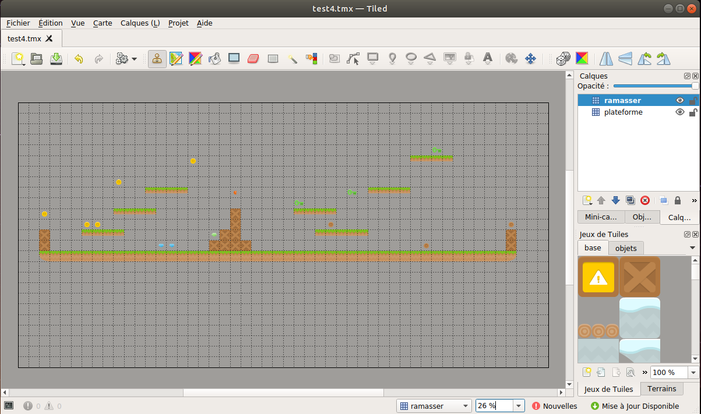

# 8 - Utiliser une carte de jeu (une *tilemap*)

Tag *v0.8*

Plutôt que de placer chaque Sprite «à la main» comme nous l'avons fait jusqu'ici, on peut utiliser une «*tilemap*».

Voilà à quoi cela ressemble dans le logiciel libre [Tiled Map Editor](https://www.mapeditor.org/).



On distingue **3 zones**: la **carte** elle-même, le **jeu de tuiles** (*tiles*) qui a servi à la «peindre» et les **calques** (*layers*) qui permettent de distinguer certains groupes de tuiles.

Ici, le calque «**ramasser**» contient les petits objets (pièces, diamands, clés...), l'autre «**plateforme**» contient les éléments de ... plateforme! 

Le logiciel produit un fichier d'extension *.tmx* qu'on peut alors charger avec arcade. Pour cela, on utilise:
- `carte = arcade.read_tmx(chemin_fichier_tmx)` - [doc](https://arcade.academy/arcade.html#arcade.read_tmx)/[src](https://arcade.academy/_modules/arcade/tilemap.html#read_tmx)

Puis, on charge *chaque calque* dans une `SpriteList` dédiée:
- `self.tuiles = arcade.process_layer(carte, nom_calque, ...)` - [doc](https://arcade.academy/arcade.html#arcade.process_layer)/[src](https://arcade.academy/_modules/arcade/tilemap.html#process_layer)

Pour voir rapidement ce que cela donne, on peut utiliser une carte des [ressources](https://arcade.academy/resources.html#resources-tmx-maps) fournies par arcade. Le chemin d'accès commence par `":resources:tmx_maps/<nom_fichier>"` où le nom du fichier est (nom fichier suivi de ses calques): `map.tmx`, `map2_level1.tmx`, ... etc.

Cartes possibles et leurs calques (pas dans la doc!):

- `level_1.tmx`: *Platforms*
- `level_2.tmx`: *Platforms*
- `map_with_custom_hitboxes.tmx`: *Coins*, *Obstructions*
- `map_with_external_tileset.tmx`: *Obstructions*
- `map_with_ladders.tmx`: *Background*, *Coins*, *Ladders*, *Platforms*, *Moving Platforms*
- `map.tmx`: *Platforms*, *Coins*
- `map2_level_1.tmx`: *Background*, *Foreground*, *Don't Touch*, *Coins*, *Platforms*
- `map2_level_2.tmx`: idem
- `test_map_1.tmx`: *Background*, *Platforms*
- `test_map_2.tmx`: *Platforms*, *Coins*, *Dirt*
- `test_map_3.tmx`: *Platforms*, *Moving Platforms*, *Text Layer*
- `test_map_4.tmx`: *Background*, *Platforms*
- `test_map_5.tmx`: *Object_layer*, *Tile_layer_1*
- `test_map_6.tmx`: *Tile_layer_1*
- `test_map_7.tmx`: semble corrompu...
- `test_objects.tmx`: *Tiles*, *Group*, *Text*, *Shapes*.

Ainsi, par exemple, et après avoir supprimé le code qui place les sprites «manuellement» (sauf pour le personnage!):

```python
    def setup(...):
        ...
        carte = arcade.read_tmx(":resources:tmx_maps/map.tmx")
        
        self.pieces = arcade.process_layer(
            carte,
            "Coins",
            # options               # par défaut   
            scaling=ECHELLE_TUILES, # 1
            use_spatial_hash=True   # False
        )
        
        self.plateformes = arcade.process_layer(
            carte,
            "Platforms,
            scaling=ECHELLE_TUILES,
            use_spatial_hash=True
        )
        ...
```

*Note1*: on peu même supprimer les déclarations `self.plateformes = arcade.SpriteList(...)` car `.process_layer(...)` renvoie ... une `SpriteList`.

*Note2*: on expliquera un peu plus tard comment faire ses propres cartes de jeu.

## Suite... 

`git checkout v0.9`